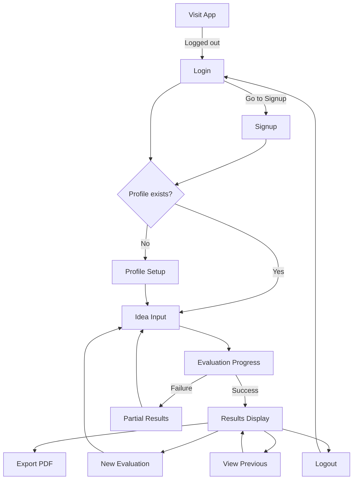

# Core User Flows

## Implementation Status (February 17, 2026)

### Flows Implemented

- Authentication flow (signup/login/logout) is implemented.
- Profile setup and profile edit flows are implemented.
- Top navbar flow is implemented for logged-in users:
  - app branding,
  - profile entry point,
  - logout path to sign-in.
- Idea submission flow (`/evaluate`) is implemented with validation and SSE submission.
- Real-time evaluation progress flow is implemented (Intake, Retrieval, Critic, Verdict).
- Results flow (`/evaluations/[id]`) is implemented with:
  - verdict + score,
  - radar chart,
  - top risks,
  - collapsible dimension details,
  - sources section,
  - previous evaluations + view-all modal.

### Flow Gaps To Fix Next

- Partial-evaluation behavior currently produces poor UX when critic output is malformed:
  - dimensions shown as unavailable,
  - misleading overall score/verdict combinations.
- Sources list flow needs readability and deduplication improvements.
- Error/partial reasoning needs better transparency in the UI (why a dimension failed, what still succeeded).
- Results flow should show stronger confidence and evidence-quality indicators.

This document defines the complete user journey through the AI Startup Idea Evaluator, from first-time setup through evaluation and results viewing.

## Overview

The application follows a **wizard-style flow** with step-by-step progression:

- **Authentication (Signup/Login)** → **Profile Setup** (first-time only / if incomplete) → **Idea Input** → **Evaluation** → **Results**
- **Email + password authentication** (Signup, Login, Logout)
  - No email verification in MVP
- **Server-side persistence per user**
  - Profile and evaluation history are stored server-side and available across devices
- **Profile is editable anytime** via a dedicated Profile page
  - Profile changes affect **future evaluations only**
  - Past evaluations remain unchanged (each evaluation stores a profile snapshot)
- Evaluation history is user-scoped and accessible from the Results screen

---

## Flow 0: Authentication (Signup / Login / Logout)

**Trigger:** User visits the application while logged out

**Steps:**

1. **Auth Gate (Login screen)**
  - User sees Login form (email + password)
  - Link: “Create account” (goes to Signup)
2. **Signup**
  - User enters email + password and submits
  - Account is created and user is logged in immediately (no email verification)
  - Post-signup routing:
    - If no profile exists yet → go to Profile Setup
    - If profile exists → go to Idea Input
3. **Login**
  - User enters email + password and submits
  - Post-login routing:
    - If profile exists → go to Idea Input
    - If profile does not exist (edge case) → go to Profile Setup
4. **Logout**
  - User clicks “Logout” in header
  - User is returned to the Login screen

---

## Flow 1: First-Time User Journey (Signup → Profile Setup)

**Trigger:** User has just signed up (or logged in) and does not yet have a profile saved on their account

**Steps:**

1. **Landing on Profile Setup**
  - After signup/login, system detects no profile on the user’s account
  - Displays profile setup questionnaire with welcome message
  - Shows progress indicator: "Step 1 of 3: Profile Setup"
2. **Completing Profile Questionnaire**
  - User fills out comprehensive profile form with fields:
    - Technical skills (checkboxes: Python, JavaScript, ML/AI, DevOps, etc.)
    - Domain expertise (checkboxes: SaaS, FinTech, HealthTech, etc.)
    - Years of experience (dropdown: 0-2, 3-5, 6-10, 10+)
    - Team size (radio: Solo, 2-3, 4-10, 10+)
    - Budget range (dropdown: <$10k, $10k-$50k, $50k-$100k, $100k+)
    - Network strength (slider: 1-10)
    - Risk tolerance (radio: Low, Medium, High)
    - Geographic location (text input)
  - All fields are required
  - "Continue to Evaluation" button enabled when form is complete
3. **Saving Profile**
  - User clicks "Continue to Evaluation"
  - System saves profile to the user’s account (server-side)
  - Transitions to Idea Input screen
  - Shows progress indicator: "Step 2 of 3: Describe Your Idea"
4. **Continues to Flow 2** (Idea Evaluation Flow)

---

## Flow 2: Idea Evaluation Flow

**Trigger:** User has completed profile setup OR is a returning user clicking "New Evaluation"

**Steps:**

1. **Idea Input Screen**
  - Header shows:
    - "New Evaluation" link (returns to Step 2 and clears current input)
    - "Profile" link (opens Profile page for editing)
    - "Logout" link
  - Main text area with placeholder: "Describe your startup idea in detail..."
  - Optional structured fields below:
    - "Target Customer" (text input)
    - "Problem Statement" (text input)
  - Category selectors (single-select):
    - Type (radio): AI Infrastructure, Vertical SaaS, Developer Tool, Consumer AI
    - Market (radio): B2B, B2C
  - "Evaluate Idea" button at bottom
  - Progress indicator: "Step 2 of 3: Describe Your Idea"
2. **Submitting for Evaluation**
  - User enters idea description (required)
  - Optionally fills structured fields and selects categories
  - Clicks "Evaluate Idea" button
  - System validates that main text area is not empty
  - Transitions to Evaluation Progress screen
3. **Evaluation Progress Screen**
  - Progress indicator: "Step 3 of 3: Evaluation"
  - Shows 4-step progress visualization:
    - ✓ Intake (completed, green)
    - ⟳ Retrieval (in progress, blue spinner)
    - ○ Strategic Critic (pending, gray)
    - ○ Verdict Generation (pending, gray)
  - Each step updates in real-time as backend progresses
  - Estimated time: "This usually takes 30-60 seconds"
  - No cancel button (evaluation runs to completion or failure)
4. **Evaluation Completion**
  - All steps show green checkmarks
  - Brief success message: "Evaluation complete!"
  - Auto-transitions to Results screen after 1 second
5. **Error Handling (if evaluation fails)**
  - Failed step shows red X icon
  - Displays partial results with completed dimensions
  - Failed dimensions marked as "Unavailable - Evaluation Error"
  - Radar chart still renders all 5 axes; unavailable dimensions appear in gray with no numeric value
  - Error message at top: "Some dimensions could not be evaluated. Results below are partial."
  - "Try Again" button returns to Idea Input with form pre-filled

---

## Flow 3: Results Viewing Flow

**Trigger:** Evaluation completes successfully OR user clicks a previous evaluation from history

**Steps:**

1. **Initial Results Display**
  - Header shows:
    - "New Evaluation" link
    - "Profile" link
    - "Logout" link
  - Top section displays (always visible):
    - **Verdict Badge**: Large GO/CONDITIONAL/NO-GO indicator with color coding
      - GO: Green badge
      - CONDITIONAL: Yellow badge
      - NO-GO: Red badge
    - **Overall Score**: Numeric score (0-100) next to verdict
    - **Radar Chart**: Interactive 5-dimension visualization
      - Dimensions: Market, Technical, Distribution, Founder Fit, Timing
      - Hover shows tooltip with exact score and dimension name
      - If a dimension is unavailable (partial results), its axis is shown in gray with no numeric value
    - **Top 3 Critical Risks**: Bullet list of key concerns
2. **Expandable Dimension Details**
  - Below initial display, 5 collapsible sections (all collapsed by default):
    - "Market Analysis" (score badge)
    - "Technical Feasibility" (score badge)
    - "Distribution Strategy" (score badge)
    - "Founder Fit" (score badge)
    - "Timing Assessment" (score badge)
  - User clicks any section to expand
  - Expanded section shows:
    - Detailed scoring rationale (2-3 paragraphs)
    - Specific strengths and weaknesses
    - Evidence-based insights
3. **Evidence Sources Section**
  - Fixed section at bottom (always visible, not expandable)
  - Title: "Sources Used"
  - Lists documents retrieved during evaluation:
    - Document name
    - Collection name (founder_principles, ai_market_data, etc.)
    - Simple bullet list format
4. **Previous Evaluations Section**
  - Below evidence sources
  - Title: "Previous Evaluations"
  - Shows up to 5 most recent evaluations as cards:
    - Idea title (first 60 characters of description)
    - Overall score (numeric)
    - Date evaluated (relative: "2 days ago")
    - Verdict badge (small)
  - Click any card to load that evaluation's results
  - "View All History" link if more than 5 evaluations exist
    - Opens a modal overlay with a scrollable list of all evaluations
    - Modal can be dismissed via an X button or clicking outside
5. **Action Buttons**
  - Primary action (top right): "Export to PDF" button
    - Generates a polished PDF including:
      - Verdict + overall score + radar chart image
      - Top critical risks
      - All 5 dimension rationales
      - Sources used
      - Original idea input (text + optional structured fields + selected categories)
      - Short “Founder Profile Summary” (from the evaluation’s profile snapshot)
    - Downloads immediately
  - Secondary action (below results): "Evaluate Another Idea" button
    - Returns to Idea Input screen (Step 2)
    - Clears previous input

---

## Flow 4: Returning User Flow

**Trigger:** User returns to the application and is logged out, or opens it from a new device

**Steps:**

1. **Login**
  - User sees Login screen and signs in
2. **Route to next step**
  - If profile exists on the account:
    - Skip profile setup
    - Land on Idea Input screen
    - Show welcome back message: "Welcome back! Ready to evaluate another idea?"
  - If profile does not exist (edge case):
    - Route to Profile Setup
3. **Continues to Flow 2** (Idea Evaluation Flow from step 1)

---

## Flow 5: View Previous Evaluation

**Trigger:** User clicks an evaluation card in "Previous Evaluations" section

**Steps:**

1. **Load Historical Evaluation**
  - System retrieves the evaluation from the user’s server-side history
  - Displays results in same format as Flow 3
  - All sections (verdict, radar chart, dimensions, evidence) populated with historical data
  - Timestamp shown at top: "Evaluated on [date]"
2. **Limited Actions**
  - "Export to PDF" still available
  - "Evaluate Another Idea" returns to Idea Input
  - No "Try Again" or edit functionality (evaluations are immutable)

---

## Flow 6: Edit Profile

**Trigger:** User clicks "Profile" in the header

**Steps:**

1. **Open Profile page**
  - Show the profile form pre-filled with the current saved values
  - Show a note: "Changes apply to future evaluations only. Past evaluations remain unchanged."
2. **Edit and save**
  - User updates any fields and clicks "Save changes"
  - System saves the updated profile to the user’s account
  - Show success feedback (toast or inline): "Profile updated"
3. **Return to evaluation**
  - User can return to "New Evaluation" or back to the prior page

---

## Navigation Summary



---

## Verdict & Scoring Policy (MVP)

- **Dimension weights:** Equal weights (20% each).
- **Overall score:** Average of the 5 dimension scores.
- **Verdict thresholds (moderate):**
  - **GO**: overall score ≥ 70
  - **CONDITIONAL**: overall score 55–69
  - **NO-GO**: overall score < 55
- **No “critical dimension” hard guardrail** in MVP (overall score solely determines verdict).
- **Weak evidence behavior:** The system always produces a verdict, but when evidence coverage is weak it must:
  - Add a prominent note near the verdict: “Low confidence due to limited evidence”
  - Be more conservative in scoring and in its written rationale

---

## Key UI Wireframes

### Login Screen

```wireframe
<!DOCTYPE html>
<html>
<head>
<style>
body { font-family: Arial, sans-serif; max-width: 420px; margin: 80px auto; padding: 20px; }
h1 { font-size: 22px; margin-bottom: 6px; }
.sub { color: #666; font-size: 14px; margin-bottom: 22px; }
.form-group { margin-bottom: 14px; }
label { display: block; font-weight: bold; margin-bottom: 6px; }
input { width: 100%; padding: 10px; border: 1px solid #ccc; border-radius: 4px; }
button { width: 100%; background: #0070f3; color: #fff; padding: 10px; border: 0; border-radius: 4px; cursor: pointer; font-size: 16px; }
.link { margin-top: 14px; font-size: 14px; }
.link a { color: #0070f3; text-decoration: none; }
</style>
</head>
<body>
<h1>Log in</h1>
<div class="sub">Access your profile and evaluations.</div>
<form>
  <div class="form-group">
    <label for="email">Email</label>
    <input id="email" type="email" data-element-id="login-email" placeholder="you@domain.com" />
  </div>
  <div class="form-group">
    <label for="password">Password</label>
    <input id="password" type="password" data-element-id="login-password" placeholder="••••••••" />
  </div>
  <button type="submit" data-element-id="login-submit">Login</button>
</form>
<div class="link">No account? <a href="#" data-element-id="goto-signup">Create one</a></div>
</body>
</html>
```

### Signup Screen

```wireframe
<!DOCTYPE html>
<html>
<head>
<style>
body { font-family: Arial, sans-serif; max-width: 420px; margin: 80px auto; padding: 20px; }
h1 { font-size: 22px; margin-bottom: 6px; }
.sub { color: #666; font-size: 14px; margin-bottom: 22px; }
.form-group { margin-bottom: 14px; }
label { display: block; font-weight: bold; margin-bottom: 6px; }
input { width: 100%; padding: 10px; border: 1px solid #ccc; border-radius: 4px; }
button { width: 100%; background: #0070f3; color: #fff; padding: 10px; border: 0; border-radius: 4px; cursor: pointer; font-size: 16px; }
.link { margin-top: 14px; font-size: 14px; }
.link a { color: #0070f3; text-decoration: none; }
</style>
</head>
<body>
<h1>Create account</h1>
<div class="sub">No email verification in MVP.</div>
<form>
  <div class="form-group">
    <label for="email">Email</label>
    <input id="email" type="email" data-element-id="signup-email" placeholder="you@domain.com" />
  </div>
  <div class="form-group">
    <label for="password">Password</label>
    <input id="password" type="password" data-element-id="signup-password" placeholder="Create a password" />
  </div>
  <button type="submit" data-element-id="signup-submit">Sign up</button>
</form>
<div class="link">Already have an account? <a href="#" data-element-id="goto-login">Log in</a></div>
</body>
</html>
```

### Profile Setup Screen

```wireframe
<!DOCTYPE html>
<html>
<head>
<style>
body { font-family: Arial, sans-serif; max-width: 600px; margin: 40px auto; padding: 20px; }
h1 { font-size: 24px; margin-bottom: 10px; }
.progress { color: #666; font-size: 14px; margin-bottom: 30px; }
.form-group { margin-bottom: 20px; }
label { display: block; font-weight: bold; margin-bottom: 5px; }
input[type="text"], select { width: 100%; padding: 8px; border: 1px solid #ccc; border-radius: 4px; }
.checkbox-group { display: flex; flex-wrap: wrap; gap: 10px; }
.checkbox-group label { font-weight: normal; }
button { background: #0070f3; color: white; padding: 12px 24px; border: none; border-radius: 4px; cursor: pointer; font-size: 16px; }
button:disabled { background: #ccc; cursor: not-allowed; }
</style>
</head>
<body>
<h1>Welcome to AI Startup Idea Evaluator</h1>
<div class="progress">Step 1 of 3: Profile Setup</div>

<form>
  <div class="form-group">
    <label>Technical Skills</label>
    <div class="checkbox-group">
      <label><input type="checkbox" data-element-id="skill-python"> Python</label>
      <label><input type="checkbox" data-element-id="skill-js"> JavaScript</label>
      <label><input type="checkbox" data-element-id="skill-ml"> ML/AI</label>
      <label><input type="checkbox" data-element-id="skill-devops"> DevOps</label>
    </div>
  </div>

  <div class="form-group">
    <label>Domain Expertise</label>
    <div class="checkbox-group">
      <label><input type="checkbox" data-element-id="domain-saas"> SaaS</label>
      <label><input type="checkbox" data-element-id="domain-fintech"> FinTech</label>
      <label><input type="checkbox" data-element-id="domain-health"> HealthTech</label>
    </div>
  </div>

  <div class="form-group">
    <label for="experience">Years of Experience</label>
    <select id="experience" data-element-id="experience-select">
      <option value="">Select...</option>
      <option value="0-2">0-2 years</option>
      <option value="3-5">3-5 years</option>
      <option value="6-10">6-10 years</option>
      <option value="10+">10+ years</option>
    </select>
  </div>

  <div class="form-group">
    <label>Team Size</label>
    <div>
      <label><input type="radio" name="team" data-element-id="team-solo"> Solo</label>
      <label><input type="radio" name="team" data-element-id="team-small"> 2-3 people</label>
      <label><input type="radio" name="team" data-element-id="team-medium"> 4-10 people</label>
    </div>
  </div>

  <div class="form-group">
    <label for="budget">Budget Range</label>
    <select id="budget" data-element-id="budget-select">
      <option value="">Select...</option>
      <option value="<10k">&lt;$10k</option>
      <option value="10k-50k">$10k-$50k</option>
      <option value="50k-100k">$50k-$100k</option>
      <option value="100k+">$100k+</option>
    </select>
  </div>

  <div class="form-group">
    <label for="location">Geographic Location</label>
    <input type="text" id="location" data-element-id="location-input" placeholder="e.g., San Francisco, CA">
  </div>

  <button type="submit" data-element-id="continue-btn">Continue to Evaluation</button>
</form>
</body>
</html>
```

### Idea Input Screen

```wireframe
<!DOCTYPE html>
<html>
<head>
<style>
body { font-family: Arial, sans-serif; max-width: 800px; margin: 40px auto; padding: 20px; }
header { display: flex; justify-content: space-between; align-items: center; margin-bottom: 30px; border-bottom: 1px solid #eee; padding-bottom: 10px; }
h1 { font-size: 24px; margin: 0; }
.nav-link { color: #0070f3; text-decoration: none; }
.progress { color: #666; font-size: 14px; margin-bottom: 30px; }
.form-group { margin-bottom: 20px; }
label { display: block; font-weight: bold; margin-bottom: 5px; }
textarea { width: 100%; min-height: 150px; padding: 10px; border: 1px solid #ccc; border-radius: 4px; font-family: Arial, sans-serif; }
input[type="text"] { width: 100%; padding: 8px; border: 1px solid #ccc; border-radius: 4px; }
.optional { color: #666; font-weight: normal; font-size: 14px; }
.checkbox-group { display: flex; gap: 20px; margin-top: 10px; }
.category-section { margin-top: 30px; padding-top: 20px; border-top: 1px solid #eee; }
button { background: #0070f3; color: white; padding: 12px 24px; border: none; border-radius: 4px; cursor: pointer; font-size: 16px; margin-top: 20px; }
</style>
</head>
<body>
<header>
  <h1>AI Startup Idea Evaluator</h1>
  <div>
    <a href="#" class="nav-link" data-element-id="new-eval-link">New Evaluation</a>
    &nbsp;|&nbsp;
    <a href="#" class="nav-link" data-element-id="profile-link">Profile</a>
    &nbsp;|&nbsp;
    <a href="#" class="nav-link" data-element-id="logout-link">Logout</a>
  </div>
</header>

<div class="progress">Step 2 of 3: Describe Your Idea</div>

<form>
  <div class="form-group">
    <label for="idea">Startup Idea Description *</label>
    <textarea id="idea" data-element-id="idea-textarea" placeholder="Describe your startup idea in detail. Include the problem you're solving, your solution, target customers, and how you plan to build it..."></textarea>
  </div>

  <div class="form-group">
    <label for="customer">Target Customer <span class="optional">(optional)</span></label>
    <input type="text" id="customer" data-element-id="customer-input" placeholder="e.g., Enterprise SaaS companies, Solo developers, etc.">
  </div>

  <div class="form-group">
    <label for="problem">Problem Statement <span class="optional">(optional)</span></label>
    <input type="text" id="problem" data-element-id="problem-input" placeholder="e.g., Manual RFP responses take 40+ hours per proposal">
  </div>

  <div class="category-section">
    <div class="form-group">
      <label>Startup Type <span class="optional">(optional)</span></label>
      <div class="checkbox-group">
        <label><input type="radio" name="startup-type" data-element-id="type-infra"> AI Infrastructure</label>
        <label><input type="radio" name="startup-type" data-element-id="type-saas"> Vertical SaaS</label>
        <label><input type="radio" name="startup-type" data-element-id="type-devtool"> Developer Tool</label>
        <label><input type="radio" name="startup-type" data-element-id="type-consumer"> Consumer AI</label>
      </div>
    </div>

    <div class="form-group">
      <label>Market <span class="optional">(optional)</span></label>
      <div class="checkbox-group">
        <label><input type="radio" name="market-type" data-element-id="market-b2b"> B2B</label>
        <label><input type="radio" name="market-type" data-element-id="market-b2c"> B2C</label>
      </div>
    </div>
  </div>

  <button type="submit" data-element-id="evaluate-btn">Evaluate Idea</button>
</form>
</body>
</html>
```

### Evaluation Progress Screen

```wireframe
<!DOCTYPE html>
<html>
<head>
<style>
body { font-family: Arial, sans-serif; max-width: 600px; margin: 80px auto; padding: 20px; text-align: center; }
h1 { font-size: 24px; margin-bottom: 10px; }
.progress { color: #666; font-size: 14px; margin-bottom: 50px; }
.steps { text-align: left; max-width: 400px; margin: 0 auto; }
.step { display: flex; align-items: center; padding: 15px; margin-bottom: 10px; border-radius: 4px; background: #f5f5f5; }
.step.completed { background: #e6f7e6; }
.step.active { background: #e6f0ff; }
.step-icon { width: 30px; height: 30px; margin-right: 15px; display: flex; align-items: center; justify-content: center; border-radius: 50%; }
.step.completed .step-icon { background: #28a745; color: white; }
.step.active .step-icon { background: #0070f3; color: white; }
.step.pending .step-icon { background: #ddd; color: #999; }
.step-name { font-weight: bold; }
.estimate { color: #666; font-size: 14px; margin-top: 30px; }
</style>
</head>
<body>
<h1>Evaluating Your Idea</h1>
<div class="progress">Step 3 of 3: Evaluation</div>

<div class="steps">
  <div class="step completed" data-element-id="step-intake">
    <div class="step-icon">✓</div>
    <div class="step-name">Intake</div>
  </div>
  
  <div class="step completed" data-element-id="step-retrieval">
    <div class="step-icon">✓</div>
    <div class="step-name">Retrieval</div>
  </div>
  
  <div class="step active" data-element-id="step-critic">
    <div class="step-icon">⟳</div>
    <div class="step-name">Strategic Critic</div>
  </div>
  
  <div class="step pending" data-element-id="step-verdict">
    <div class="step-icon">○</div>
    <div class="step-name">Verdict Generation</div>
  </div>
</div>

<div class="estimate">This usually takes 30-60 seconds</div>
</body>
</html>
```

### Results Display Screen

```wireframe
<!DOCTYPE html>
<html>
<head>
<style>
body { font-family: Arial, sans-serif; max-width: 900px; margin: 40px auto; padding: 20px; }
header { display: flex; justify-content: space-between; align-items: center; margin-bottom: 30px; border-bottom: 1px solid #eee; padding-bottom: 10px; }
h1 { font-size: 24px; margin: 0; }
.nav-link { color: #0070f3; text-decoration: none; }
.export-btn { background: #0070f3; color: white; padding: 10px 20px; border: none; border-radius: 4px; cursor: pointer; }
.verdict-section { background: #f9f9f9; padding: 30px; border-radius: 8px; margin-bottom: 30px; }
.verdict-badge { display: inline-block; padding: 10px 20px; border-radius: 4px; font-size: 24px; font-weight: bold; margin-bottom: 20px; }
.verdict-badge.go { background: #28a745; color: white; }
.verdict-badge.conditional { background: #ffc107; color: black; }
.verdict-badge.no-go { background: #dc3545; color: white; }
.overall-score { font-size: 36px; font-weight: bold; margin-left: 20px; }
.radar-chart { width: 400px; height: 400px; margin: 30px auto; background: #fff; border: 1px solid #ddd; display: flex; align-items: center; justify-content: center; color: #999; }
.risks { margin-top: 20px; }
.risks h3 { font-size: 18px; margin-bottom: 10px; }
.risks ul { margin: 0; padding-left: 20px; }
.dimension-section { border: 1px solid #ddd; border-radius: 4px; margin-bottom: 10px; }
.dimension-header { padding: 15px; background: #f5f5f5; cursor: pointer; display: flex; justify-content: space-between; align-items: center; }
.dimension-header:hover { background: #eee; }
.dimension-score { background: #0070f3; color: white; padding: 4px 12px; border-radius: 12px; font-size: 14px; }
.dimension-content { padding: 20px; display: none; border-top: 1px solid #ddd; }
.dimension-content.expanded { display: block; }
.sources { margin-top: 40px; padding-top: 20px; border-top: 2px solid #eee; }
.sources h3 { font-size: 18px; margin-bottom: 10px; }
.source-item { padding: 8px 0; }
.source-name { font-weight: bold; }
.source-collection { color: #666; font-size: 14px; }
.history { margin-top: 40px; padding-top: 20px; border-top: 2px solid #eee; }
.history h3 { font-size: 18px; margin-bottom: 15px; }
.history-card { border: 1px solid #ddd; padding: 15px; border-radius: 4px; margin-bottom: 10px; cursor: pointer; }
.history-card:hover { background: #f9f9f9; }
.history-title { font-weight: bold; margin-bottom: 5px; }
.history-meta { color: #666; font-size: 14px; }
.new-eval-btn { background: #28a745; color: white; padding: 12px 24px; border: none; border-radius: 4px; cursor: pointer; font-size: 16px; margin-top: 30px; }
</style>
</head>
<body>
<header>
  <h1>AI Startup Idea Evaluator</h1>
  <div>
    <button class="export-btn" data-element-id="export-pdf-btn">Export to PDF</button>
    &nbsp;
    <a href="#" class="nav-link" data-element-id="profile-link">Profile</a>
    &nbsp;|&nbsp;
    <a href="#" class="nav-link" data-element-id="logout-link">Logout</a>
  </div>
</header>

<div class="verdict-section">
  <div>
    <span class="verdict-badge conditional" data-element-id="verdict-badge">CONDITIONAL GO</span>
    <span class="overall-score" data-element-id="overall-score">68</span>
  </div>
  
  <div class="radar-chart" data-element-id="radar-chart">
    [Interactive Radar Chart]<br>
    Hover for dimension scores
  </div>
  
  <div class="risks">
    <h3>Top Critical Risks</h3>
    <ul>
      <li>High market saturation in AI chatbot space</li>
      <li>Distribution challenge: Enterprise sales cycle 6-12 months</li>
      <li>Technical replicability risk: Low barrier to entry</li>
    </ul>
  </div>
</div>

<div class="dimension-section" data-element-id="market-section">
  <div class="dimension-header">
    <span><strong>Market Analysis</strong></span>
    <span class="dimension-score">72</span>
  </div>
  <div class="dimension-content">
    <p>Detailed market analysis rationale goes here...</p>
  </div>
</div>

<div class="dimension-section" data-element-id="technical-section">
  <div class="dimension-header">
    <span><strong>Technical Feasibility</strong></span>
    <span class="dimension-score">85</span>
  </div>
  <div class="dimension-content">
    <p>Detailed technical analysis rationale goes here...</p>
  </div>
</div>

<div class="dimension-section" data-element-id="distribution-section">
  <div class="dimension-header">
    <span><strong>Distribution Strategy</strong></span>
    <span class="dimension-score">55</span>
  </div>
  <div class="dimension-content">
    <p>Detailed distribution analysis rationale goes here...</p>
  </div>
</div>

<div class="dimension-section" data-element-id="founder-section">
  <div class="dimension-header">
    <span><strong>Founder Fit</strong></span>
    <span class="dimension-score">78</span>
  </div>
  <div class="dimension-content">
    <p>Detailed founder fit analysis rationale goes here...</p>
  </div>
</div>

<div class="dimension-section" data-element-id="timing-section">
  <div class="dimension-header">
    <span><strong>Timing Assessment</strong></span>
    <span class="dimension-score">62</span>
  </div>
  <div class="dimension-content">
    <p>Detailed timing analysis rationale goes here...</p>
  </div>
</div>

<div class="sources">
  <h3>Sources Used</h3>
  <div class="source-item">
    <div class="source-name">The Lean Startup - Chapter 3</div>
    <div class="source-collection">founder_principles</div>
  </div>
  <div class="source-item">
    <div class="source-name">Stanford AI Index 2024</div>
    <div class="source-collection">ai_market_data</div>
  </div>
  <div class="source-item">
    <div class="source-name">YC AI Startups - Enterprise Tools</div>
    <div class="source-collection">startup_examples</div>
  </div>
</div>

<div class="history">
  <h3>Previous Evaluations</h3>
  <div class="history-card" data-element-id="history-card-1">
    <div class="history-title">AI agent that automates RFP responses for enterprises</div>
    <div class="history-meta">Score: 72 • 2 days ago • CONDITIONAL GO</div>
  </div>
  <div class="history-card" data-element-id="history-card-2">
    <div class="history-title">Vertical AI SaaS for legal contract analysis</div>
    <div class="history-meta">Score: 81 • 5 days ago • GO</div>
  </div>
</div>

<button class="new-eval-btn" data-element-id="new-eval-btn">Evaluate Another Idea</button>
</body>
</html>
```

### Profile Page (Edit Profile)

```wireframe
<!DOCTYPE html>
<html>
<head>
<style>
body { font-family: Arial, sans-serif; max-width: 700px; margin: 40px auto; padding: 20px; }
header { display: flex; justify-content: space-between; align-items: center; margin-bottom: 20px; border-bottom: 1px solid #eee; padding-bottom: 10px; }
.nav a { color: #0070f3; text-decoration: none; margin-left: 10px; }
h1 { font-size: 22px; margin: 0; }
.note { background: #f5f5f5; padding: 10px 12px; border-radius: 6px; color: #444; font-size: 14px; margin: 14px 0 20px; }
.form-group { margin-bottom: 16px; }
label { display: block; font-weight: bold; margin-bottom: 6px; }
input[type="text"], select { width: 100%; padding: 8px; border: 1px solid #ccc; border-radius: 4px; }
.checkbox-group { display: flex; flex-wrap: wrap; gap: 10px; }
.checkbox-group label { font-weight: normal; }
.actions { display: flex; gap: 10px; margin-top: 18px; }
button { background: #0070f3; color: white; padding: 10px 16px; border: none; border-radius: 4px; cursor: pointer; }
.secondary { background: #fff; color: #0070f3; border: 1px solid #0070f3; }
</style>
</head>
<body>
<header>
  <h1>Your Profile</h1>
  <div class="nav">
    <a href="#" data-element-id="nav-new-eval">New Evaluation</a>
    <a href="#" data-element-id="nav-logout">Logout</a>
  </div>
</header>
<div class="note">
  Changes apply to future evaluations only. Past evaluations remain unchanged (they keep a profile snapshot).
</div>
<form>
  <div class="form-group">
    <label>Technical Skills</label>
    <div class="checkbox-group">
      <label><input type="checkbox" data-element-id="skill-python"> Python</label>
      <label><input type="checkbox" data-element-id="skill-js"> JavaScript</label>
      <label><input type="checkbox" data-element-id="skill-ml"> ML/AI</label>
      <label><input type="checkbox" data-element-id="skill-devops"> DevOps</label>
    </div>
  </div>
  <div class="form-group">
    <label for="location">Geographic Location</label>
    <input type="text" id="location" data-element-id="profile-location" placeholder="e.g., Berlin, Germany" />
  </div>
  <div class="actions">
    <button type="submit" data-element-id="profile-save">Save changes</button>
    <button type="button" class="secondary" data-element-id="profile-cancel">Cancel</button>
  </div>
</form>
</body>
</html>
```

### History Modal (View All History)

```wireframe
<!DOCTYPE html>
<html>
<head>
<style>
body { font-family: Arial, sans-serif; margin: 0; }
.backdrop { position: fixed; top: 0; left: 0; right: 0; bottom: 0; background: rgba(0,0,0,0.5); display: flex; align-items: center; justify-content: center; padding: 20px; }
.modal { background: #fff; width: 700px; max-width: 100%; border-radius: 8px; overflow: hidden; }
.modal-header { display: flex; justify-content: space-between; align-items: center; padding: 15px 20px; border-bottom: 1px solid #eee; }
.modal-title { font-weight: bold; }
.close-btn { border: 1px solid #ccc; background: #fff; padding: 6px 10px; border-radius: 4px; cursor: pointer; }
.modal-body { max-height: 60vh; overflow: auto; padding: 10px 20px 20px; }
.row { border: 1px solid #ddd; border-radius: 6px; padding: 12px; margin-top: 10px; cursor: pointer; }
.row:hover { background: #f9f9f9; }
.row-title { font-weight: bold; margin-bottom: 6px; }
.row-meta { color: #666; font-size: 14px; }
</style>
</head>
<body>
<div class="backdrop">
  <div class="modal">
    <div class="modal-header">
      <div class="modal-title">All Evaluations</div>
      <button class="close-btn" data-element-id="history-modal-close">X</button>
    </div>
    <div class="modal-body">
      <div class="row" data-element-id="history-row-1">
        <div class="row-title">AI agent that automates RFP responses for enterprises</div>
        <div class="row-meta">Score: 72 • 2 days ago</div>
      </div>
      <div class="row" data-element-id="history-row-2">
        <div class="row-title">Vertical AI SaaS for legal contract analysis</div>
        <div class="row-meta">Score: 81 • 5 days ago</div>
      </div>
      <div class="row" data-element-id="history-row-3">
        <div class="row-title">Developer tool that monitors LLM hallucinations in production</div>
        <div class="row-meta">Score: 64 • 2 weeks ago</div>
      </div>
    </div>
  </div>
</div>
</body>
</html>
```

---

## Information Hierarchy

**Primary (Always Visible):**

- Verdict decision (GO/CONDITIONAL/NO-GO)
- Overall score
- Radar chart visualization
- Top 3 critical risks

**Secondary (Expandable):**

- Detailed dimension analysis (5 sections)
- Full risk breakdown within each dimension

**Tertiary (Fixed but Lower Priority):**

- Evidence sources
- Previous evaluations

**Actions:**

- Primary: Export to PDF (top right, always visible)
- Secondary: New Evaluation (header link + bottom button)
- Tertiary: View previous evaluations (click history cards)

---

## State Communication

**Loading States:**

- Profile setup: Form validation (button disabled until complete)
- Evaluation: 4-step progress indicator with real-time updates
- Results: Instant display (no loading after evaluation completes)

**Success States:**

- Profile saved: Immediate transition to Idea Input
- Evaluation complete: Green checkmarks + auto-transition to results
- PDF export: Browser download initiated

**Error States:**

- Evaluation failure: Partial results with red X on failed steps
- Missing required fields: Inline validation messages
- Network errors: Error banner with retry option

**Empty States:**

- No previous evaluations: "No previous evaluations yet" message
- First-time user: Welcome message on profile setup
