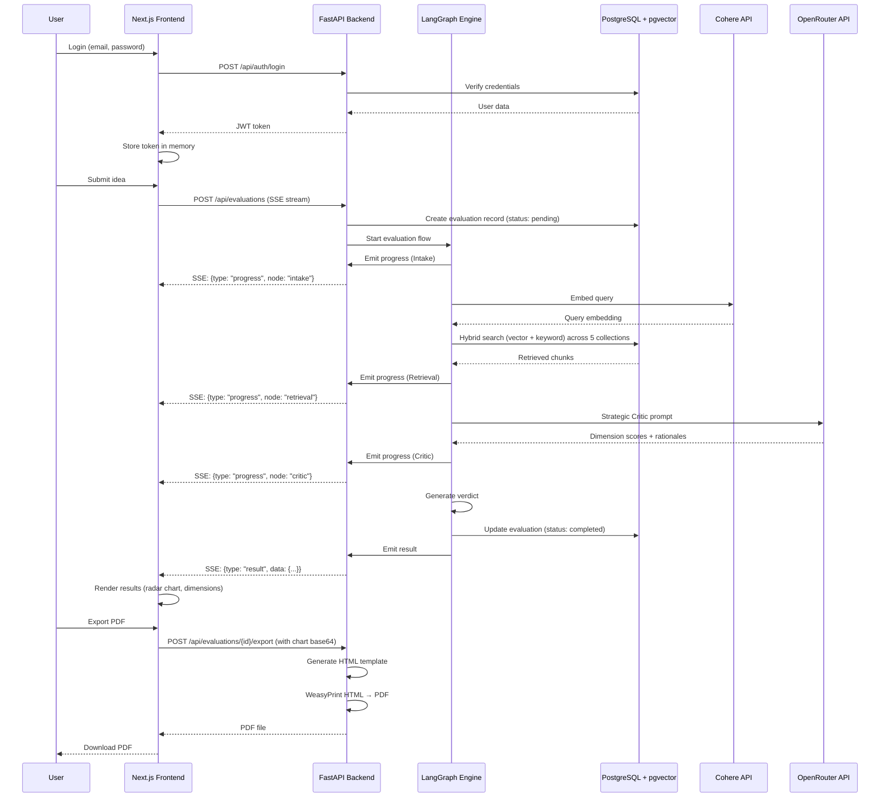

# Technical Architecture Plan

## Architectural Approach

### Overall System Design

**Monorepo Structure:**

- Single repository with `/frontend` and `/backend` folders
- Shared configuration and coordinated versioning
- Simplified development workflow for rapid MVP iteration

**Technology Stack:**

**Frontend:**

- **Next.js 14+** (React with SSR/SSG)
- **TypeScript** for type safety
- **Chart.js** for radar chart visualization
- **Tailwind CSS** for styling
- **Axios** for API communication
- **EventSource API** for Server-Sent Events (progress updates)

**Backend:**

- **FastAPI** (Python 3.11+) - async-native web framework
- **LangGraph + LangChain** - orchestration for the 4-node evaluation flow
- **SQLAlchemy 2.0** - ORM for database access
- **Alembic** - database migrations
- **Pydantic** - data validation and settings management
- **python-jose** - JWT token handling
- **passlib + bcrypt** - password hashing
- **WeasyPrint** - HTML-to-PDF generation

**Data & AI:**

- **PostgreSQL 15+** with **pgvector extension** - relational data + vector search
- **Cohere embed-english-v3.0** - text embeddings (API-based)
- **OpenRouter** - LLM inference (cheap models: DeepSeek, Qwen, etc.)

### Key Architectural Patterns

**1. Stateless Authentication (JWT)**

- Frontend stores JWT token in memory (not localStorage for security)
- Token included in `Authorization: Bearer <token>` header on all API requests
- Backend validates token signature on each request (no session storage)
- Token expiry: 7 days (configurable)
- No refresh tokens in MVP (user re-authenticates on expiry)

**Trade-offs:**

- ✅ Simple, scalable (no server-side session state)
- ✅ Works well with Next.js SSR/client-side rendering
- ❌ Token revocation requires additional infrastructure (deferred to post-MVP)

**2. Server-Sent Events for Real-Time Progress**

- Evaluation endpoint (`POST /api/evaluations`) returns SSE stream
- Backend emits progress events as LangGraph nodes complete:
  - `{type: "progress", node: "intake", status: "completed"}`
  - `{type: "progress", node: "retrieval", status: "in_progress"}`
  - `{type: "result", data: {...}}`
- Frontend uses EventSource API to consume stream and update UI
- Connection closes automatically when evaluation completes or fails

**Trade-offs:**

- ✅ Simple HTTP-based streaming (no WebSocket infrastructure)
- ✅ Built-in browser support (EventSource API)
- ✅ Works through most proxies/firewalls
- ❌ Unidirectional (server → client only; sufficient for this use case)

**3. Synchronous LangGraph Execution**

- Evaluation runs synchronously in the API request handler
- No background job queue (Celery/RQ) in MVP
- Request timeout: 120 seconds (sufficient for 30-60s evaluations)
- If evaluation fails mid-stream, SSE emits error event and closes

**Trade-offs:**

- ✅ Simpler architecture (no job queue, no worker processes)
- ✅ Immediate feedback (no polling for job status)
- ❌ Ties up a request handler during evaluation (acceptable for MVP scale)
- ❌ No retry mechanism (user must re-submit; acceptable for MVP)

**4. Separate Tables Per Vector Collection**

- 5 PostgreSQL tables: `founder_principles_docs`, `ai_market_data_docs`, `startup_examples_docs`, `technical_constraints_docs`, `personal_profile_docs`
- Each table has: `id`, `content`, `embedding` (vector), `metadata` (JSONB), `created_at`
- pgvector index on `embedding` column for fast similarity search
- PostgreSQL full-text search (tsvector) on `content` for keyword search (BM25-like)

**Trade-offs:**

- ✅ Clean separation, easier to optimize per collection
- ✅ Simpler queries (no collection filtering in WHERE clause)
- ❌ More tables to manage (acceptable for 5 collections)

**5. Profile Snapshots via Separate Table**

- `profile_snapshots` table stores immutable profile versions
- `evaluations` table has foreign key to `profile_snapshots`
- When user edits profile, new snapshot is created only on next evaluation
- Deduplication: if profile hasn't changed, reuse existing snapshot

**Trade-offs:**

- ✅ Normalized, avoids data duplication if profile rarely changes
- ✅ Easy to query historical profile state
- ❌ Requires join to fetch evaluation with profile (acceptable overhead)

### Constraints & Assumptions

**Technical Constraints:**

- PostgreSQL 15+ required (pgvector extension)
- Python 3.11+ required (for LangChain/LangGraph compatibility)
- Node.js 18+ required (for Next.js 14)

**Business Constraints:**

- 1-2 week MVP timeline → prioritize simplicity over scalability
- Seed data: 1-3 documents per collection (minimal corpus)
- Single-user focus (no team collaboration)

**Regulatory Constraints:**

- No email verification → simpler signup, but higher spam risk (acceptable for MVP)
- No GDPR compliance features in MVP (data export, deletion, etc.)

---

## Data Model

### Database Schema (PostgreSQL + pgvector)

**Core Tables:**

```sql
-- Users (authentication)
CREATE TABLE users (
    id UUID PRIMARY KEY DEFAULT gen_random_uuid(),
    email VARCHAR(255) UNIQUE NOT NULL,
    hashed_password VARCHAR(255) NOT NULL,
    created_at TIMESTAMP DEFAULT NOW(),
    updated_at TIMESTAMP DEFAULT NOW()
);

-- User Profiles (editable)
CREATE TABLE profiles (
    id UUID PRIMARY KEY DEFAULT gen_random_uuid(),
    user_id UUID UNIQUE NOT NULL REFERENCES users(id) ON DELETE CASCADE,
    technical_skills TEXT[], -- e.g., ['Python', 'JavaScript', 'ML/AI']
    domain_expertise TEXT[], -- e.g., ['SaaS', 'FinTech']
    years_experience VARCHAR(10), -- e.g., '3-5'
    team_size VARCHAR(20), -- e.g., 'Solo', '2-3'
    budget_range VARCHAR(20), -- e.g., '$10k-$50k'
    network_strength INTEGER, -- 1-10
    risk_tolerance VARCHAR(10), -- 'Low', 'Medium', 'High'
    geographic_location VARCHAR(255),
    created_at TIMESTAMP DEFAULT NOW(),
    updated_at TIMESTAMP DEFAULT NOW()
);

-- Profile Snapshots (immutable)
CREATE TABLE profile_snapshots (
    id UUID PRIMARY KEY DEFAULT gen_random_uuid(),
    user_id UUID NOT NULL REFERENCES users(id) ON DELETE CASCADE,
    profile_data JSONB NOT NULL, -- Full profile as JSON
    created_at TIMESTAMP DEFAULT NOW(),
    UNIQUE(user_id, profile_data) -- Deduplication
);

-- Evaluations
CREATE TABLE evaluations (
    id UUID PRIMARY KEY DEFAULT gen_random_uuid(),
    user_id UUID NOT NULL REFERENCES users(id) ON DELETE CASCADE,
    profile_snapshot_id UUID NOT NULL REFERENCES profile_snapshots(id),
    
    -- Idea Input
    idea_description TEXT NOT NULL,
    target_customer TEXT,
    problem_statement TEXT,
    startup_type VARCHAR(50), -- 'AI Infrastructure', 'Vertical SaaS', etc.
    market_type VARCHAR(10), -- 'B2B', 'B2C'
    
    -- Evaluation Results
    overall_score INTEGER, -- 0-100
    verdict VARCHAR(20), -- 'GO', 'CONDITIONAL', 'NO-GO'
    
    -- Dimension Scores
    market_score INTEGER,
    technical_score INTEGER,
    distribution_score INTEGER,
    founder_fit_score INTEGER,
    timing_score INTEGER,
    
    -- Detailed Analysis
    dimension_analyses JSONB, -- {market: {rationale: "...", strengths: [...], weaknesses: [...]}, ...}
    top_risks TEXT[],
    evidence_sources JSONB, -- [{doc_name: "...", collection: "...", chunk_id: "..."}, ...]
    
    -- Metadata
    low_confidence BOOLEAN DEFAULT FALSE,
    status VARCHAR(20) DEFAULT 'pending', -- 'pending', 'completed', 'failed', 'partial'
    error_message TEXT,
    created_at TIMESTAMP DEFAULT NOW()
);

CREATE INDEX idx_evaluations_user_created ON evaluations(user_id, created_at DESC);
```

**Vector Collection Tables (5 tables):**

```sql
-- Template for each collection (founder_principles_docs, ai_market_data_docs, etc.)
CREATE TABLE {collection_name}_docs (
    id UUID PRIMARY KEY DEFAULT gen_random_uuid(),
    content TEXT NOT NULL,
    embedding vector(1024), -- Cohere embed-english-v3.0 dimension
    metadata JSONB, -- {source: "...", title: "...", section: "...", ...}
    created_at TIMESTAMP DEFAULT NOW()
);

-- pgvector index for similarity search
CREATE INDEX idx_{collection_name}_embedding ON {collection_name}_docs 
USING ivfflat (embedding vector_cosine_ops) WITH (lists = 100);

-- Full-text search index for keyword search
ALTER TABLE {collection_name}_docs ADD COLUMN content_tsvector tsvector
    GENERATED ALWAYS AS (to_tsvector('english', content)) STORED;
CREATE INDEX idx_{collection_name}_fts ON {collection_name}_docs USING GIN(content_tsvector);
```

**Relationships:**

- `users` 1:1 `profiles` (one profile per user)
- `users` 1:N `profile_snapshots` (multiple snapshots over time)
- `users` 1:N `evaluations` (multiple evaluations per user)
- `profile_snapshots` 1:N `evaluations` (snapshot reused across evaluations if unchanged)

**Indexes:**

- Primary keys on all tables (UUID)
- Unique constraint on `users.email`
- Unique constraint on `profiles.user_id`
- Composite unique on `profile_snapshots(user_id, profile_data)` for deduplication
- Index on `evaluations(user_id, created_at DESC)` for history queries
- pgvector indexes on all `*_docs.embedding` columns
- Full-text search indexes on all `*_docs.content_tsvector` columns

---

## Component Architecture

### System Overview



### Frontend Architecture (Next.js)

**Directory Structure:**

```
frontend/
├── app/
│   ├── (auth)/
│   │   ├── login/page.tsx
│   │   └── signup/page.tsx
│   ├── (app)/
│   │   ├── layout.tsx (authenticated layout with header)
│   │   ├── profile/
│   │   │   ├── setup/page.tsx (first-time profile)
│   │   │   └── edit/page.tsx (edit profile)
│   │   ├── evaluate/page.tsx (idea input)
│   │   ├── evaluations/
│   │   │   └── [id]/page.tsx (results view)
│   │   └── page.tsx (redirect to /evaluate)
│   └── layout.tsx (root layout)
├── components/
│   ├── auth/ (LoginForm, SignupForm)
│   ├── profile/ (ProfileForm)
│   ├── evaluation/ (IdeaInputForm, ProgressIndicator, ResultsDisplay, RadarChart)
│   └── ui/ (Button, Input, Modal, etc.)
├── lib/
│   ├── api.ts (Axios instance with JWT interceptor)
│   ├── auth.ts (JWT token management)
│   └── types.ts (TypeScript interfaces)
└── public/
```

**Key Components:**

**1. Authentication Flow:**

- `LoginForm` / `SignupForm` → POST to `/api/auth/login` or `/api/auth/signup`
- Store JWT token in React state (not localStorage)
- Axios interceptor adds `Authorization: Bearer <token>` to all requests
- Redirect to `/profile/setup` if no profile, else `/evaluate`

**2. Profile Management:**

- `ProfileForm` (reusable for setup and edit)
- POST to `/api/profiles` (create) or PUT `/api/profiles` (update)
- Validation: all fields required for setup, optional for edit

**3. Idea Evaluation:**

- `IdeaInputForm` → POST to `/api/evaluations` (SSE endpoint)
- `ProgressIndicator` listens to SSE stream, updates UI in real-time
- On completion, redirect to `/evaluations/{id}`

**4. Results Display:**

- `RadarChart` (Chart.js) renders 5-dimension scores
- Expandable dimension sections (client-side state)
- History list at bottom (fetch from `/api/evaluations`)
- Export button → POST to `/api/evaluations/{id}/export` with chart as base64

**5. SSE Handling:**

```typescript
const eventSource = new EventSource('/api/evaluations', {
  headers: { Authorization: `Bearer ${token}` }
});

eventSource.addEventListener('progress', (e) => {
  const data = JSON.parse(e.data);
  updateProgress(data.node, data.status);
});

eventSource.addEventListener('result', (e) => {
  const result = JSON.parse(e.data);
  redirectToResults(result.id);
  eventSource.close();
});

eventSource.addEventListener('error', (e) => {
  handleError(e);
  eventSource.close();
});
```

### Backend Architecture (FastAPI)

**Directory Structure:**

```
backend/
├── app/
│   ├── main.py (FastAPI app initialization)
│   ├── config.py (settings via Pydantic)
│   ├── database.py (SQLAlchemy engine, session)
│   ├── models/ (SQLAlchemy ORM models)
│   │   ├── user.py
│   │   ├── profile.py
│   │   ├── evaluation.py
│   │   └── documents.py (vector collection models)
│   ├── schemas/ (Pydantic schemas for request/response)
│   │   ├── auth.py
│   │   ├── profile.py
│   │   └── evaluation.py
│   ├── api/
│   │   ├── auth.py (login, signup, logout)
│   │   ├── profiles.py (CRUD for profiles)
│   │   ├── evaluations.py (create, list, get, export)
│   │   └── deps.py (dependency injection: get_current_user, get_db)
│   ├── services/
│   │   ├── auth_service.py (JWT creation, password hashing)
│   │   ├── profile_service.py (profile CRUD, snapshot management)
│   │   ├── evaluation_service.py (orchestrates LangGraph)
│   │   ├── retrieval_service.py (hybrid search across collections)
│   │   └── pdf_service.py (WeasyPrint PDF generation)
│   ├── langgraph/
│   │   ├── graph.py (LangGraph flow definition)
│   │   ├── nodes/
│   │   │   ├── intake.py (extract structured idea)
│   │   │   ├── retrieval.py (multi-collection hybrid search)
│   │   │   ├── critic.py (strategic scoring)
│   │   │   └── verdict.py (final verdict generation)
│   │   └── state.py (LangGraph state schema)
│   └── utils/
│       ├── embeddings.py (Cohere API wrapper)
│       └── llm.py (OpenRouter API wrapper)
├── alembic/ (database migrations)
└── tests/
```

**Key API Endpoints:**

**Authentication:**

- `POST /api/auth/signup` → Create user, return JWT
- `POST /api/auth/login` → Verify credentials, return JWT
- `POST /api/auth/logout` → (No-op in stateless JWT; client discards token)

**Profiles:**

- `POST /api/profiles` → Create profile (first-time setup)
- `GET /api/profiles/me` → Get current user's profile
- `PUT /api/profiles/me` → Update profile

**Evaluations:**

- `POST /api/evaluations` (SSE) → Start evaluation, stream progress
- `GET /api/evaluations` → List user's evaluations (paginated)
- `GET /api/evaluations/{id}` → Get single evaluation with full details
- `POST /api/evaluations/{id}/export` → Generate PDF (accepts chart base64 in body)

**Dependency Injection:**

```python
# app/api/deps.py
from fastapi import Depends, HTTPException, status
from fastapi.security import HTTPBearer, HTTPAuthorizationCredentials
from jose import JWTError, jwt

security = HTTPBearer()

async def get_current_user(
    credentials: HTTPAuthorizationCredentials = Depends(security),
    db: Session = Depends(get_db)
) -> User:
    token = credentials.credentials
    try:
        payload = jwt.decode(token, SECRET_KEY, algorithms=[ALGORITHM])
        user_id = payload.get("sub")
        if user_id is None:
            raise HTTPException(status_code=401, detail="Invalid token")
    except JWTError:
        raise HTTPException(status_code=401, detail="Invalid token")
    
    user = db.query(User).filter(User.id == user_id).first()
    if user is None:
        raise HTTPException(status_code=401, detail="User not found")
    return user
```

### LangGraph Evaluation Flow

**State Schema:**

```python
from typing import TypedDict, List, Dict

class EvaluationState(TypedDict):
    # Input
    idea_description: str
    target_customer: str | None
    problem_statement: str | None
    startup_type: str | None
    market_type: str | None
    profile_data: Dict
    
    # Intermediate
    structured_idea: Dict  # Extracted by Intake node
    retrieved_chunks: List[Dict]  # Retrieved by Retrieval node
    dimension_scores: Dict[str, int]  # Scored by Critic node
    dimension_analyses: Dict[str, Dict]  # Detailed rationales
    
    # Output
    overall_score: int
    verdict: str  # 'GO', 'CONDITIONAL', 'NO-GO'
    top_risks: List[str]
    evidence_sources: List[Dict]
    low_confidence: bool
```

**Graph Definition:**

```python
from langgraph.graph import StateGraph

# Define nodes
graph = StateGraph(EvaluationState)

graph.add_node("intake", intake_node)
graph.add_node("retrieval", retrieval_node)
graph.add_node("critic", critic_node)
graph.add_node("verdict", verdict_node)

# Define edges (linear flow for MVP)
graph.set_entry_point("intake")
graph.add_edge("intake", "retrieval")
graph.add_edge("retrieval", "critic")
graph.add_edge("critic", "verdict")
graph.set_finish_point("verdict")

evaluation_graph = graph.compile()
```

**Node Implementations:**

**1. Intake Node:**

- Input: Raw idea description + optional fields
- Process: LLM call to extract structured representation (customer, problem, solution, technical core, classification)
- Output: `structured_idea` dict
- Emit SSE: `{type: "progress", node: "intake", status: "completed"}`

**2. Retrieval Node:**

- Input: `structured_idea` + `profile_data`
- Process:
  - Generate query embedding via Cohere
  - Hybrid search across 5 collections:
    - Vector search: `SELECT * FROM {collection}_docs ORDER BY embedding <=> query_embedding LIMIT 5`
    - Keyword search: `SELECT * FROM {collection}_docs WHERE content_tsvector @@ to_tsquery('query') LIMIT 5`
  - Merge and deduplicate results (top 10 per collection)
- Output: `retrieved_chunks` (list of {content, source, collection})
- Emit SSE: `{type: "progress", node: "retrieval", status: "completed"}`

**3. Critic Node:**

- Input: `structured_idea` + `retrieved_chunks` + `profile_data`
- Process:
  - LLM call (OpenRouter) with structured prompt:
    - Evaluate across 5 dimensions (Market, Technical, Distribution, Founder Fit, Timing)
    - Score each dimension 0-100
    - Provide rationale, strengths, weaknesses per dimension
    - Identify top 3 critical risks
    - Flag low confidence if evidence is weak
  - Parse LLM response into structured format
- Output: `dimension_scores`, `dimension_analyses`, `top_risks`, `low_confidence`
- Emit SSE: `{type: "progress", node: "critic", status: "completed"}`

**4. Verdict Node:**

- Input: `dimension_scores`
- Process:
  - Calculate `overall_score` = average of 5 dimension scores
  - Determine `verdict`:
    - GO if overall_score >= 70
    - CONDITIONAL if 55 <= overall_score < 70
    - NO-GO if overall_score < 55
  - Extract `evidence_sources` from `retrieved_chunks`
- Output: `overall_score`, `verdict`, `evidence_sources`
- Emit SSE: `{type: "result", data: {evaluation_id, overall_score, verdict, ...}}`

**SSE Streaming in FastAPI:**

```python
from fastapi.responses import StreamingResponse
from sse_starlette.sse import EventSourceResponse

@router.post("/evaluations")
async def create_evaluation(
    request: EvaluationCreate,
    current_user: User = Depends(get_current_user),
    db: Session = Depends(get_db)
):
    async def event_generator():
        # Create evaluation record
        evaluation = create_evaluation_record(db, current_user.id, request)
        
        # Run LangGraph with callbacks
        async for event in run_evaluation_graph(evaluation, db):
            if event["type"] == "progress":
                yield {"event": "progress", "data": json.dumps(event)}
            elif event["type"] == "result":
                yield {"event": "result", "data": json.dumps(event)}
            elif event["type"] == "error":
                yield {"event": "error", "data": json.dumps(event)}
    
    return EventSourceResponse(event_generator())
```

### PDF Export Service

**Flow:**

1. Frontend sends POST to `/api/evaluations/{id}/export` with:
  - `chart_base64`: Base64-encoded PNG of radar chart (from Chart.js canvas)
2. Backend fetches evaluation + profile snapshot from DB
3. Generate HTML template with:
  - Verdict badge, overall score
  - Embedded radar chart image (base64)
  - Top risks
  - 5 dimension sections (scores + rationales)
  - Evidence sources
  - Original idea input
  - Profile summary
4. WeasyPrint converts HTML → PDF
5. Return PDF as file download

**HTML Template Structure:**

```html
<!DOCTYPE html>
<html>
<head>
  <style>
    /* PDF-friendly CSS (no flexbox/grid, use tables/floats) */
    body { font-family: Arial, sans-serif; }
    .verdict { font-size: 24px; font-weight: bold; }
    .verdict.go { color: green; }
    .verdict.conditional { color: orange; }
    .verdict.no-go { color: red; }
    .radar-chart { text-align: center; }
    .dimension { page-break-inside: avoid; }
  </style>
</head>
<body>
  <h1>Startup Idea Evaluation Report</h1>
  <div class="verdict {{ verdict_class }}">{{ verdict }}</div>
  <p>Overall Score: {{ overall_score }}/100</p>
  
  <div class="radar-chart">
    
  </div>
  
  <h2>Top Critical Risks</h2>
  <ul>
    
    <li>{{ risk }}</li>
    
  </ul>
  
  <!-- Dimension sections, sources, idea input, profile summary -->
</body>
</html>
```

### Data Ingestion (Seed Documents)

**Initial Setup Script:**

- Python script to ingest 1-3 documents per collection
- Semantic chunking via LangChain `RecursiveCharacterTextSplitter` with paragraph separators
- Embed chunks via Cohere API
- Insert into respective `*_docs` tables

**Example:**

```python
from langchain.text_splitter import RecursiveCharacterTextSplitter

splitter = RecursiveCharacterTextSplitter(
    chunk_size=512,
    chunk_overlap=50,
    separators=["\n\n", "\n", ". ", " "]  # Paragraph/sentence boundaries
)

chunks = splitter.split_text(document_text)

for chunk in chunks:
    embedding = cohere_client.embed(texts=[chunk]).embeddings[0]
    db.execute(
        f"INSERT INTO {collection}_docs (content, embedding, metadata) VALUES (%s, %s, %s)",
        (chunk, embedding, {"source": doc_name, "title": doc_title})
    )
```

---

## Integration Points

**Frontend ↔ Backend:**

- REST API over HTTPS
- JWT authentication on all protected endpoints
- SSE for real-time evaluation progress
- JSON request/response bodies

**Backend ↔ PostgreSQL:**

- SQLAlchemy ORM for CRUD operations
- Raw SQL for pgvector similarity search (via SQLAlchemy `text()`)
- Alembic for schema migrations

**Backend ↔ Cohere:**

- HTTP API for text embeddings
- Batch embedding for document ingestion
- Single embedding for query at evaluation time

**Backend ↔ OpenRouter:**

- HTTP API for LLM inference
- Structured prompts with JSON response format
- Retry logic for transient failures

**Frontend ↔ PDF Export:**

- Frontend captures Chart.js canvas as base64 PNG
- Sends to backend via POST request
- Backend generates PDF and returns as file download

---

## Deployment Considerations (Post-MVP)

**Development:**

- Docker Compose for local development (PostgreSQL + pgvector, backend, frontend)
- Hot reload for both frontend and backend

**Production (Future):**

- Frontend: Vercel or Netlify (Next.js SSR/SSG)
- Backend: Railway, Render, or AWS ECS (containerized FastAPI)
- Database: Managed PostgreSQL (Supabase, Neon, or AWS RDS) with pgvector extension
- Secrets: Environment variables for API keys (Cohere, OpenRouter, JWT secret)

&nbsp;